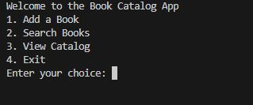
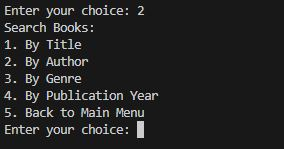

# JasperDayuno_T1A3
# Book Catalog Application
This Python application manages a book catalog, allowing users to add books with details like title, author, genre, and publication year. It offers search functionalities by title, author, genre, or publication year, displaying results and saving the catalog to a JSON file for persistence. Ideal for basic book inventory management.

**Link to Gitub repo**
https://github.com/JTD20123/JasperDayuno_T1A3

### Features 

**Main Menu**

"Welcome to the Book Catalog App"
1. Add a Book
2. Search Books
3. View Catalog
4. Exit

Logic 

Add a book ('1')
Add a Book: Input details (title, author, genre, year) to add a new book to the catalog. Validate and save updates.

Search books ('2')
Enter criteria (title, author, genre, year) to find matching books in the catalog. Display results.

View Catalog ('3')
Display all books currently in the catalog, including their titles, authors, genres, and publication years, allows removal by entering book number or cancels with '0'. Updates catalog and saves changes automatically.

Exit ('4')
Terminate the application gracefully and save any changes made to the catalog data.

### book_functions.py

**load_catalog_from_json:**
Loads book data from 'catalog.json' into the catalog list using global scope. Handles file errors and JSON decoding exceptions gracefully for robust application startup.

**save_books_to_json:**
Converts catalog data into JSON format and saves it to 'catalog.json'. Utilizes loops to iterate through catalog entries and conditional structures to ensure proper data formatting.

**add_book:**
Adds a new book to the catalog with user-inputted details. Uses variables for book attributes and employs loops for input validation. Handles invalid publication year format errors with conditional prompts.

**search_books:**
Searches catalog based on user-selected criteria (title, author, genre, year). Uses loops for iterating through catalog entries and conditional structures for filtering results based on user input.

**display_search_results:**
Formats and displays search results to users based on found_books list. Utilizes loops to iterate through search results and conditional structures to handle cases where no books match search criteria.

### Project Planning

